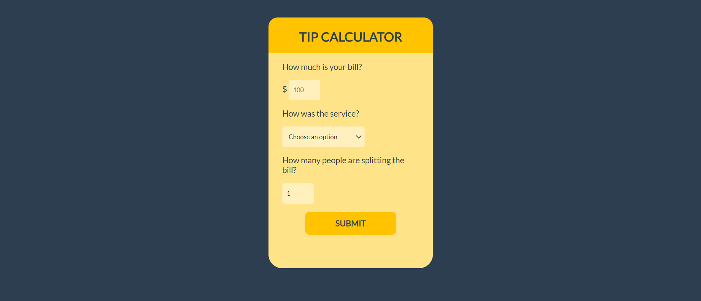

# Tip Calculator App

This is a simple web application that calculates the tip for a bill and divides it among a number of people. It was developed as part of a three part course by OneBitCode.

## Getting Started

To run the application, click [here](https://haushinka56.github.io/Tip-Calculator/)

  

## Usage

1. Enter the bill amount, the desired tip percentage and the number of people to split the bill among
2. Click the "Calculate" button to calculate the tip and split the bill
3. The calculated tip will be displayed, divided by the number of people

## Features

- Calculates the tip amount based on the bill amount and tip percentage
- Divides the tip value among a specified number of people
- Displays the amount each person owes, rounded to two decimal places
- Validates user input to ensure it is a valid number

## Technologies Used

- HTML
- CSS
- JavaScript

## Credits

This application was developed as part of a three part course on HTML, CSS and JS by Onebitcode. You can find the course materials and more information [here](https://start.onebitcode.com/aulas).

## License

This project is licensed under the MIT License - see the [LICENSE.md](LICENSE.md) file for details.

  
